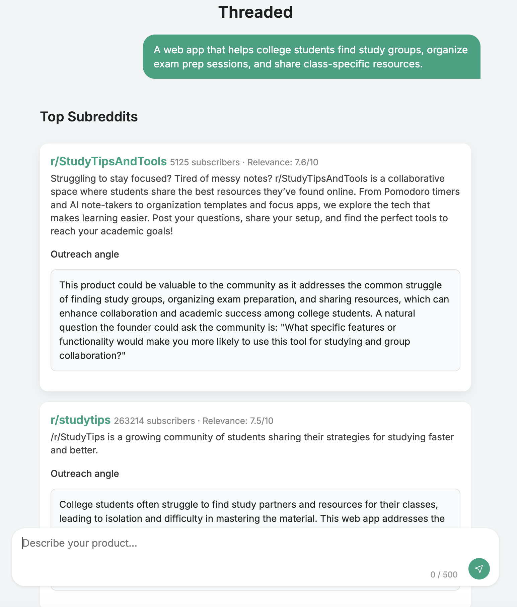
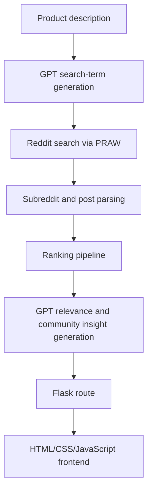

# Threaded

Threaded is a Reddit audience-research tool for audience research: discovering communities where potential users are already discussing problems related to a product idea.

Given a short product description, Threaded generates Reddit-style search terms, searches for relevant subreddits and posts, ranks communities by relevance and engagement signals, and surfaces community insights that help founders understand where their product may fit naturally.

The goal is not to automate posting or spam communities. Threaded is designed to help builders identify relevant conversations, understand user pain points, and learn from those communities thoughtfully.

## Demo



## Overview

Threaded helps answer questions like:

- Where are people already talking about this problem?
- Which subreddits are most relevant to this product?
- Which communities are active enough to be worth researching?
- What pain points are users expressing?
- How could a founder ask useful, non-promotional questions in those communities?

The app takes a product description, searches Reddit, ranks candidate communities and posts, and displays a shortlist of relevant subreddits with community insights.

## Architecture



## Ranking formula

Threaded ranks candidate communities using a weighted combination of relevance, engagement, recency, and receptiveness signals.

```text
score =
  0.55 * relevance_score +
  0.20 * engagement_score +
  0.15 * recency_score +
  0.10 * receptiveness_score
```

Where:

- `relevance_score` estimates how closely the subreddit or post matches the product description.
- `engagement_score` rewards communities and posts with stronger activity signals.
- `recency_score` rewards recent posts and active discussions.
- `receptiveness_score` estimates whether the community appears open to discussion around the product's problem space.

The formula is intentionally simple and interpretable. Threaded prioritizes explainable ranking over opaque recommendation behavior.

## Features

- Generates Reddit-style search terms from a product description
- Searches Reddit for relevant subreddits and posts using PRAW
- Parses subreddit metadata and post-level engagement signals
- Ranks communities using relevance, engagement, recency, and receptiveness
- Uses GPT to classify post relevance and generate community insights
- Provides a lightweight Flask web interface for exploring results
- Uses environment variables for local secret management

## Example input

```text
A web app that helps college students find study groups, organize exam prep sessions, and share class-specific resources.
```

## Tech stack

- Python
- Flask
- PRAW
- OpenAI API
- NumPy
- scikit-learn
- python-dotenv
- HTML/CSS/JavaScript

## Setup

Clone the repository:

```bash
git clone https://github.com/tsdevictor/threaded.git
cd threaded
```

Create and activate a virtual environment:

```bash
python3.12 -m venv venv
source venv/bin/activate
```

Install dependencies:

```bash
pip install -r requirements.txt
```

Create a local environment file:

```bash
cp .env.example .env
```

Add your API credentials to `.env`.

Run the app:

```bash
python app.py
```

Then open:

```text
http://127.0.0.1:5000
```

## Environment variables

Create a `.env` file using `.env.example` as a template.

Required variables:

```env
OPENAI_API_KEY=your_openai_api_key
REDDIT_CLIENT_ID=your_reddit_client_id
REDDIT_CLIENT_SECRET=your_reddit_client_secret
REDDIT_USER_AGENT=threaded/0.1 by your_username
SECRET_KEY=replace_with_a_random_secret_key
```

Do not commit your real `.env` file. The committed `.env.example` file should contain only placeholder values.

## Project structure

```text
threaded/
  core/          GPT and relevance-scoring logic
  services/      subreddit and post-processing logic
  routes/        Flask routes
  static/        frontend JavaScript and CSS
  templates/     HTML templates
  screenshots/   demo screenshots
tests/           unit tests for ranking and parsing logic
```

## Security and privacy notes

- API keys are loaded from local environment variables and should never be committed.
- `.env.example` documents required variables using placeholder values only.
- User input is handled through the Flask backend before being sent to external APIs.
- The app is intended for local development and research workflows, not production deployment.
- Generated community insights should be reviewed by a human before engaging with any community.

## Limitations

- Reddit API behavior is subject to rate limits and availability.
- Search results depend on subreddit metadata, post content, and Reddit's own ranking behavior.
- GPT-generated relevance judgments may be noisy and should not be treated as ground truth.
- Subreddit norms vary widely; a relevant community is not necessarily an appropriate place to post.
- Threaded does not automate Reddit posting and should not be used for spam, astroturfing, or deceptive promotion.
- The current app uses local Flask development settings and is not configured for production deployment.

## License

MIT License.